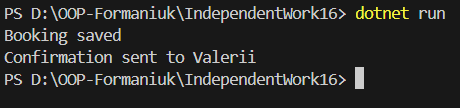

# **Самостійна робота №16**

## **Тема: Схема розподілу відповідальностей модуля `SRP`

### **Мета роботи**

- Навчитись застосовувати принцип єдиної відповідальності `SRP` для декомпозиції складного модуля на прастіші та зрозуміліші класи, а також візуалізувати розподіл відповідаоьностей за допомогою `UML`-діаграми класів.

### **Теоретичні відомості**

- **Принцип єдиної відповідальності `SRP`** означає, що кожен клас повинен мати лише одну причину для змін, тобто виконувати одну логічну задачу. Порушення `SRP` призводить до створення так званих `God Object` класів, які виконують забагато функцій і є складними для підтримки.

- **Декомпозиція** це прцес розбиття складного класу або модуля на менші, простіші компоненти, кожен з яких має чітко визначену відповідальність.

- **`UML`- діаграма класів** дозволяє графічно показати структуру програми, класи, інтерфейси та зв'язки між ними.

### **Хід роботи**

#### **Реалізація поганого класу `BookingService`

- Спочатку був створений клас `BookingService`, який порушує принцип `SRP`, оскільки:
    - перевіряє дані користувача;
    - перевіряє доступність;
    - зберігає бронювання;
    - надсилає підтвердження.
- Такий клас виконує кілька різних відповідальностей, що є прикладом `God Object`.

#### **Рефакторинг згідно `SRP`

- Для дотримання принципу `SRP` функціональність була розділена на окремі інтерфейси та класи:

- **Інтерфейси:**
    - `IBookingValidator` перевірка коректності даних;
    - `IAvailabilityChecker` перевірка доступності даних;
    - `IBookingRepository` збереження бронювання;
    - `IConfirmationSender` надсилання підтвердження.
- **Реалізіції:**
    - `BookingValidator`
    - `AvailabilityChecker`
    - `BookingRepository`
    - `ConfirmationSender`
- Клас `BookingService` тепер відповідає лише за координацію процесу бронювання та залежить від абстракцій (інтерфейсів), що відповідає принципу інверсії залежності `DIP`.

#### **`UML`-діаграма класів**

- Для візуалізації рефакторингової структури була створена `UML`-діаграма класів, яка показує:
    - всі інтерфейси та класи;
    - реалізацію інтерфейсів;
    - залежності класу `BookingService`.

#### **Запуск програми**

- У методі `Main` були створені об'єкти всіх необхідних класів та викликано метод створення бронювання. Результат роботи програми виводиться у консоль командою `dotnet run` 

#### **Висновок**

- У ході виконання самостійної роботи було реалізовано приклад порушення принципу `SRP` та виконано його рефакторинг. розділення відповідальностей між окремими класами зробило код більш зрозумілим, гнучким та легким для підтримки. Використання `UML`-діаграми допомогло наочно показати структуру програми та взвємозв'язки між її компонентами.