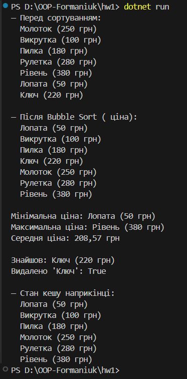

# Самостійна робота №1 — Generics Cache<Т> + Bubble Sort метод бульбашки

**Тема** розробити узагальнений кеш Cache<Т> із можливістю:
**Мета:** показати роботу з узагальненими типами, власними винятками, обчисленнями з колекціями та сортуванням без LINQ (Bubble Sort метод бульбашки).

## Суть

- Узагальнений `Cache<T> where T : class, new()` з місткістю та витісненням FIFO.
- Методи `Add`, `Find`, `Where`, `All`, `Remove`, `BubbleSort(IComparer<T>)`, `Min/Max`.
- Власні винятки: `InvalidInputException`, `NotFoundException`.
- Сутність `Product` + `ProductPriceComparer`.
- Демонстрація в `Program.cs` з `try-catch`.
- Обчислення: мін/макс/середнє без LINQ.

## Запуск

Після вводу команди
`dotnet run`
виводиться результат

