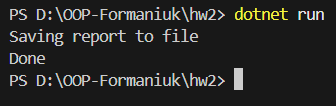

# **Домашня робота №2**

## **Виявлення God-class. SRP**

## **Мета роботи:**

Розібратись з анти-патерном God-class, виявити порушення принципу `Single Responsibility Principle (SRP)` та показати приклад рефакторингу коду відповідно до SRP.

## 1. Анти-патерн God-class

God-class (God Object) це клас, який бере на себе занадто багато відповідальностей і фактично керує всією логікою програми.

Основні ознаки God-class:

містить багато методів, які виконують різні задачі;

поєднує роботу з даними, бізнес-логіку та інфраструктуру;

має кілька причин для змін;

важко підтримується та тестується.

Такий підхід порушує принцип SRP, згідно з яким клас повинен мати лише одну відповідальність.

## 2. Приклад порушення SRP (God-class)

У файлі `Old.cs` наведено клас `BadReportGenerator`, який є прикладом God-class.
Чому це порушення SRP:

* клас одночасно:

  * отримує дані з бази;

  * обробляє дані;

  * форматує звіт;

  * зберігає файл;

  * керує всім процесом створення звіту;

* у класу є декілька відповідальностей;

* будь-яка зміна логіки потребує зміни цього ж класу.

## 3. Рефакторинг відповідно до SRP

Для усунення проблеми логіку було розділено на окремі інтерфейси та класи, кожен з яких відповідає за одну задачу.

Інтерфейс збереження звіту

`public interface IReportSaver`

Реалізації інтерфейсу

`public class FileReportSaver : IReportSaver`

## 4. Сервіс генерації звіту

Клас `ReportService` не виконує конкретну логіку, а координує роботу компонентів.

Переваги такого підходу:

* кожен клас має одну відповідальність;

* дотримується принцип SRP;

* легко змінювати формат або спосіб збереження звіту;

* відсутній God-class.

## 5. Висновок

У ході роботи було виявлено приклад God-class, який порушує принцип `Single Responsibility Principle.`
Після рефакторингу логіку було розділено на окремі компоненти, що зробило код більш зрозумілим, гнучким та легким у підтримці.

## Запуск

Після вводу команди
`dotnet run`
виводиться результат

