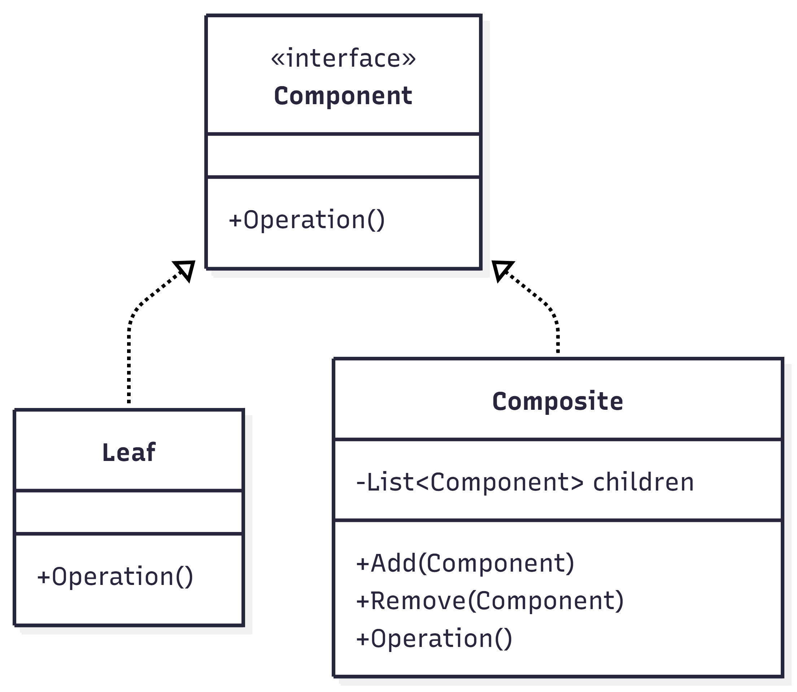
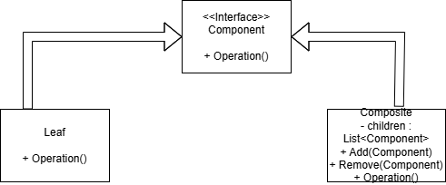

# **Лекція №19**

## **Патерн `Composite` (Компоновувальник)**

**`Composite` (Компоновувальник)** — це структурний патерн проєктування, який дозволяє організовувати об’єкти у вигляді дерева.  
Він дає можливість однаково працювати як з окремими об’єктами, так і з їх групами через спільний інтерфейс.

У патерні використовується:

- **`Component`** — спільний інтерфейс
- **`Leaf`** — окремий елемент
- **`Composite`** — група елементів

## Як працює Composite

Усі елементи реалізують один інтерфейс.  
Прості елементи `Leaf` виконують дію самостійно.  
Складені елементи `Composite` зберігають список дочірніх компонентів і передають їм виклик методу.

Таким чином, при виклику операції у верхнього елемента вона автоматично виконується для всієї структури.  
Дерево поводиться як одна колекція.

## **Приклади використання**

### **1. Файлова система**

- Файл — **`Leaf`**
- Папка — **`Composite`**

Папка може містити файли та інші папки.  
Якщо видалити папку — видаляється все всередині.

### **2. Меню сайту або програми**

- Пункт меню — **`Leaf`**
- Підменю — **`Composite`**

Система однаково відображає як прості пункти, так і вкладені меню.

### **3. Графічні об’єкти (ігри, редактори)**

- Окрема фігура — **`Leaf`**
- Група фігур — **`Composite`**

При переміщенні групи переміщуються всі об’єкти всередині.

## **Переваги**

- Однаковий підхід до роботи з елементами і групами  
- Спрощення клієнтського коду  
- Зручна побудова ієрархій  
- Легке розширення системи  

## **Недоліки**

- Може ускладнювати структуру системи  
- Велика кількість об’єктів  
- Складніше контролювати обмеження вкладеності  

## UML-діаграми

## Висновок

Патерн Composite дозволяє працювати з ієрархічними структурами як з єдиною колекцією.  
Він широко застосовується у файлових системах, меню інтерфейсів та графічних редакторах.
