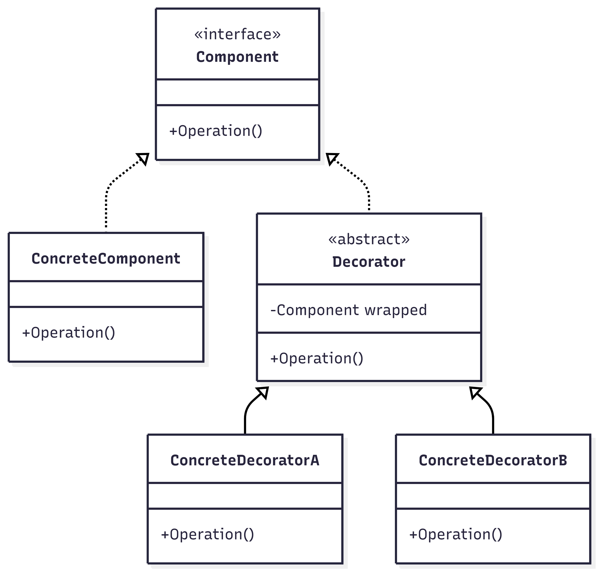
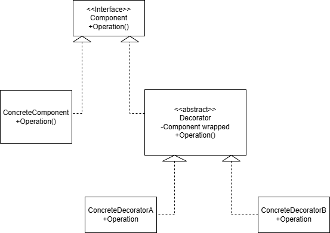

# **Патерн `Decorator` (Декоратор)**

**`Decorator` (Декоратор)** — це структурний патерн проєктування, який дозволяє динамічно додавати нову функціональність до об’єкта без зміни його коду.  

Замість створення великої кількості підкласів, об’єкт обгортається в інший об’єкт-декоратор, який розширює його поведінку.

У патерні використовується:

- **`Component`** — спільний інтерфейс
- **`ConcreteComponent`** — базовий об’єкт
- **`Decorator`** — абстрактна обгортка
- **`ConcreteDecorator`** — конкретне розширення функціональності

## **Як працює Decorator**

Декоратор має той самий інтерфейс, що й основний об’єкт, і зберігає посилання на нього.  

Коли викликається метод:

1. Декоратор викликає метод базового об’єкта.
2. Потім додає власну додаткову поведінку.

Таким чином, можна комбінувати декоратори між собою та поступово розширювати функціональність об’єкта.

## **Приклади використання патерна**

### **1. Кава в кафе**

- Базова кава — **`ConcreteComponent`**
- Молоко, цукор, сироп — **`ConcreteDecorator`**

До простої кави можна додати молоко, потім сироп, потім цукор — і кожен раз це нова комбінація без створення нового класу.

### **2. Потоки вводу-виводу (`Stream` у `.NET` або `Java`)**

Наприклад:

- Базовий `FileStream`
- `BufferedStream`
- `CryptoStream`

Можна обгорнути один потік в інший і додати шифрування або буферизацію.

### **3. `UI`-компоненти**

- Звичайна кнопка
- Кнопка з тінню
- Кнопка з рамкою
- Кнопка з анімацією

Замість створення підкласів для кожної комбінації, можна обгорнути кнопку декораторами.

## **Переваги**

- Динамічне додавання функціональності  
- Не потрібно створювати багато підкласів  
- Гнучка комбінація поведінки  
- Відповідає принципу відкритості/закритості (OCP)

## **Недоліки**

- Може створювати багато дрібних об’єктів  
- Ускладнює структуру системи  
- Порядок застосування декораторів може мати значення  

## UML-діаграми

## **Висновок**

Патерн `Decorator` дозволяє розширювати поведінку об’єкта без зміни його початкового коду.  
Він є гнучкою альтернативою наслідуванню та часто використовується в системах, де функціональність потрібно додавати поступово або комбінувати.
