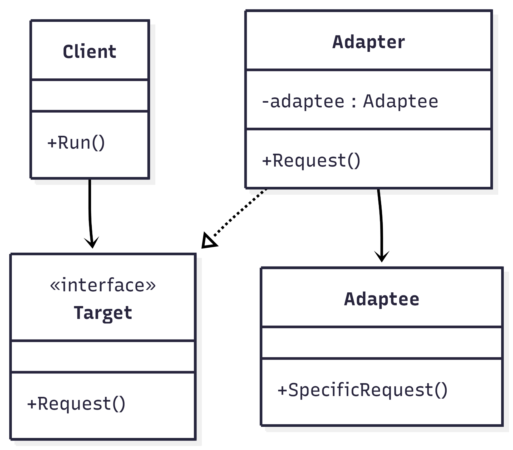
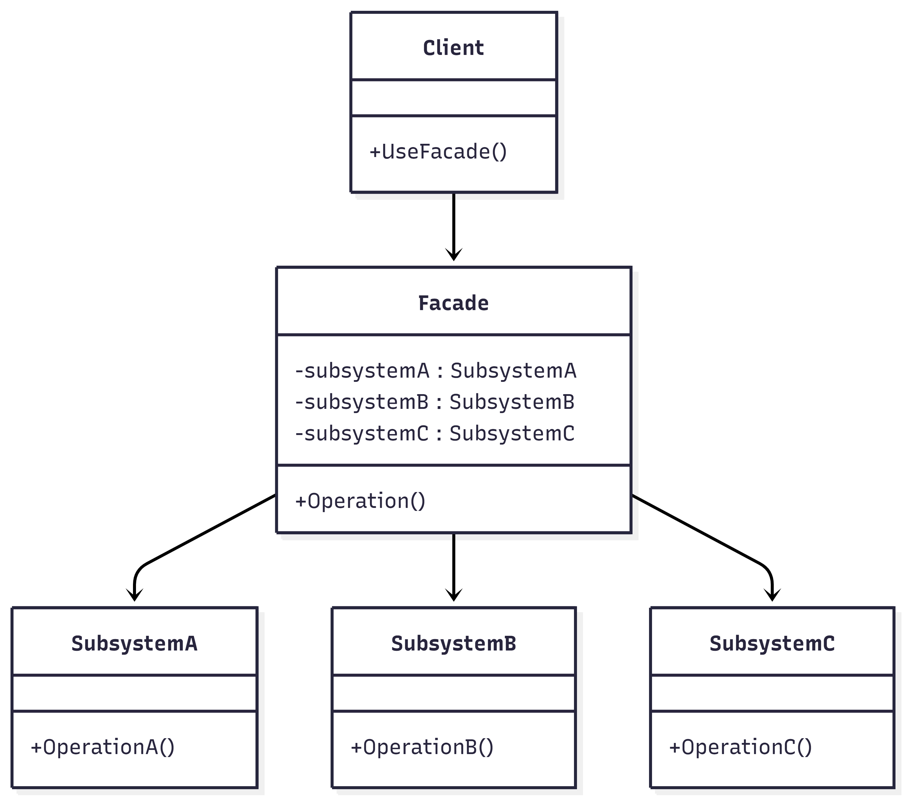
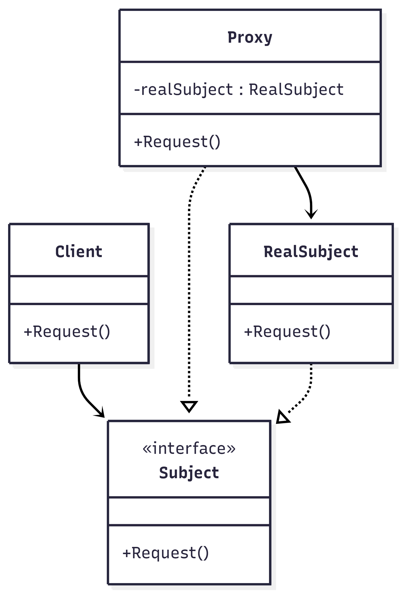

# **Лекція №20**

## **`Adapter / Facade / Proxy` — коли застосовувати?**

Ці патерни допомагають зробити програму більш зрозумілою, гнучкою та правильно організованою.  
Кожен із них використовується в різних ситуаціях.

## **1. `Adapter` Адаптер**

Adapter застосовують тоді, коли потрібно об’єднати два класи з різними інтерфейсами.  
Тобто вони не можуть працювати разом напряму.

### **Приклад**

Є старий клас, який працює з XML.  
Нова система працює з JSON.  

Щоб не змінювати старий код, створюється Adapter, який перетворює JSON у XML або навпаки.

### **Вирішує проблему**

- Несумісність інтерфейсів  
- Інтеграцію старих та нових систем  

## **2. `Facade` Фасад**

Facade використовують тоді, коли система складається з великої кількості класів і має складну структуру.

### **Приклад***

Інтернет-магазин має:

- перевірку товару  
- оплату  
- доставку  
- створення замовлення  

Замість того щоб клієнт викликав кожен клас окремо, створюється клас `OrderFacade`, який має метод `PlaceOrder()`.  
Він виконує всі дії автоматично.

### **Вирішує проблему***

- Зменшує складність коду  
- Приховує деталі реалізації  
- Спрощує використання системи  

## **3. `Proxy` Проксі**

Proxy застосовують тоді, коли потрібно контролювати доступ до об’єкта або додати додаткову логіку.

### **Приклад****

На онлайн-платформі є відео.  
Тільки зареєстровані користувачі можуть їх переглядати.

Proxy перевіряє авторизацію перед тим, як надати доступ до відео.

Також Proxy може реалізувати ліниве завантаження (об’єкт створюється тільки при першому зверненні).

## **Вирішує проблему****

- Контроль доступу  
- Оптимізацію ресурсів  
- Додавання додаткової логіки без зміни основного класу  

## **Відмінність між патернами**

- **`Adapter`** — робить несумісні інтерфейси сумісними  
- **`Facade`** — спрощує взаємодію зі складною системою  
- **`Proxy`** — контролює доступ до об’єкта

## UML-діаграми

## **Висновок**

Adapter, Facade і Proxy використовуються для різних задач.

Adapter допомагає інтегрувати різні системи.  
Facade спрощує складну архітектуру.  
Proxy забезпечує контроль і додаткову функціональність.

Головне — правильно визначити проблему, а потім обрати відповідний патерн.
