Підключаю простір імен using System для доступу класів .NET 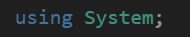

Далі оголошую простір імен namespace lab1v11.
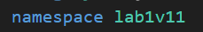

Створюю class Plane (літак) 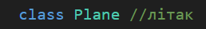 

який описує об'єкт (Літак).

Додаю приватні поля які зберігають дані про авіакомпанію та модель літака ці поля приховані від завнішнього доступу (інкапсуляція) 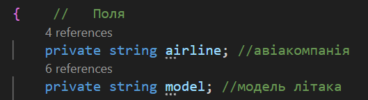

Створюю публічну властивість з автоматичними методами get i set які дозволяють читати або ж змінювати кількість місць в літаку 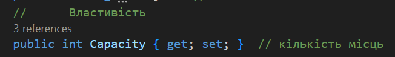

Створюю конструктор 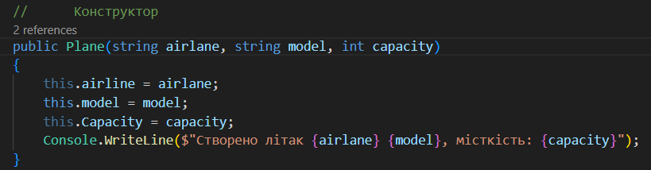 який викликається автоматично при створенні об'єкта. Ініціалізує (запускає) поля airline, model та властивість Capacity та виводить повідомлення у консоль.

Створюю деструктор 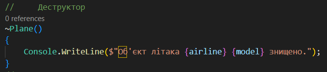 який спрацьовує при знищенні об'єкта. 

В даному коді використовується для демонстрації.

Створюю метод Fly() 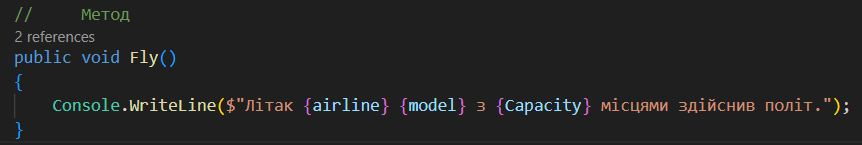 який виводить повідомлення, що літак здійснив політ.

Додатково створив метод PrintInfo() 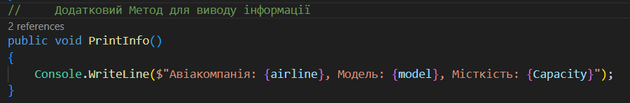 який виводить повну інформацію про літак.

Далі йде клас Program з методом Main 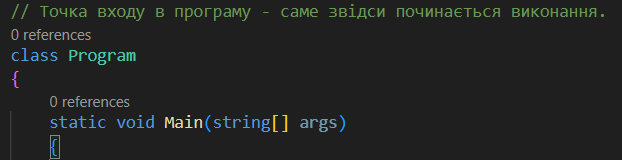 початок входу в програму, саме звідси починається виконання.

Створюю два об'єкти типу Plane(літак) 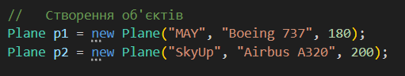
p1 - літак авіакомпанії "MAY" моделі "Boeing 737" з 180 місцями на борт

p2 - літак авіакомпанії "SkyUp" моделі "Airbus A320" з 200 місцями на борту.

Роблю виклик методів Fly() 

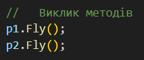 

для кожного об'єкта та у консолі виводиться повідомлення про політ.

Викликаю методи PrintInfo() 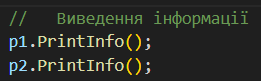 

де виводиться детальна інформація про кожен літак.

Завершення програми командою Console.ReadKey();
 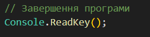
 
  Програма чекає, поки користувач натисне будь-яку клавішу для завершення програми.