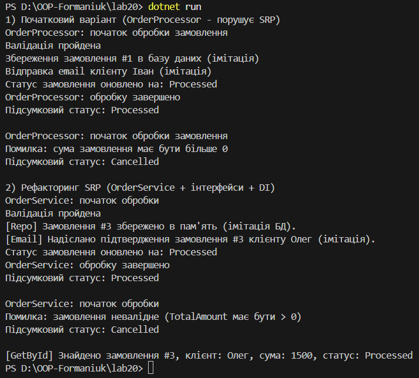

# **Лабораторна робота №20**

## **SRP декомпозиція OrderProcessor**

## **Мета роботи**

Застосувати принцип однієї відповідальності `SRP` для декомпозиції складного класу `OrderProcessor` на менші, більш сфокусовані компоненти з вмкористанням інтерфейсів та `Dependency Injection`

## **Опис завдання**

1. Створити консольний проєкт `lab20`
2. Реалізувати початковий клас `OrderProcessor`, який порушує принцип SRP
3. Виконати рефакторинг цього класу відповідно до SRP
4. Продемонструвати роботу програми для валідних та невалідних замовлень.

## **Початкова реалізація, порушення SRP**

На початку було створено клас `OrderProcessor`, який у одному методі `ProcessOrder` виконує одразу кілька різних задач:

- перевіряє коректність замовлення;
- зберігає замовлення в базу даних (імітація);
- надсилає email-сповіщення клієнту;
- оновлює статус замовлення.

Такий підхід порушує принцип SRP, оскільки клас має більше ніж одну відповідальність і його складно підтримувати або розширювати.

## **Рефакторинг відповідно до SRP**

Для дотримання принципу єдиної відповідальності логіку було розділено на окремі компоненти.

## **Використані інтерфейси**

- `IOrderValidator`  відповідає лише за валідацію замовлення;
- `IOrderRepository`  відповідає за збереження та отримання замовлень;
- `IEmailService`  відповідає за надсилання повідомлень клієнту.

## **Реалізації інтерфейсів**

- `SimpleOrderValidator` — проста перевірка суми замовлення;
- `InMemoryOrderRepository` — імітація бази даних у пам’яті;
- `ConsoleEmailService` — імітація відправки email через консоль.

## **Клас `OrderService`**

Клас `OrderService` координує роботу всіх компонентів і приймає залежності через конструктор (`Dependency Injection`). Сам клас не виконує конкретну бізнес-логіку, а лише керує процесом обробки замовлення.

## **Демонстрація роботи програми**

У методі `Main` було:

- створено приклад валідного замовлення;
- створено приклад невалідного замовлення;
- продемонстровано роботу початкового `OrderProcessor`;
- продемонстровано роботу рефакторингового `OrderService`;
- перевірено отримання замовлення через метод `GetById`.

## **Запуск**

- Після вводу команди `dotnet run` виводиться результат у консоль

