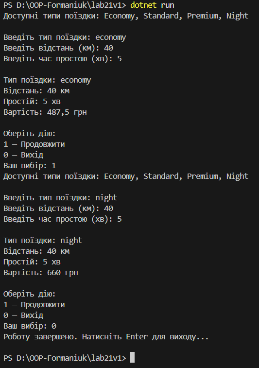

# **Лабораторна робота №21**

## **ТЕМА** OCP: гнучкі алгоритми розрахунку (Factory / Strategy)

### **Мета роботи**

Метою лабораторної роботи є застосування принципу відкритості/закритості (Open–Closed Principle, OCP) для створення гнучкої системи розрахунку вартості. У роботі використано шаблони проєктування `Strategy` та `Factory Method`, які дозволяють додавати нові алгоритми без зміни існуючого коду.

### **Варіант №1 Служба таксі**

#### **Стратегії**

- `Economy`
- `Standart`
- `Premium`
- `Night`

#### **Параметри**

- Відстань (км)
- Час простою (хв)

#### **Логіка**

- Для кожного типу поїздки використовується свій тариф розрахунку вартості.

#### **Опис реалізації**

- `ITaxiStrategy`  інтерфейс, який описує метод розрахунку вартості поїздки.
- `EconomyTaxiStrategy, StandardTaxiStrategy, PremiumTaxiStrategy`  реалізації стратегій з різними тарифами.
- `NightTaxiStrategy`  додаткова стратегія (нічна поїздка), яка демонструє принцип OCP.
- `TaxiStrategyFactory`  фабрика, яка створює потрібну стратегію на основі введеного типу поїздки.
- `TaxiService`  сервісний клас, який не залежить від конкретних стратегій, а працює лише з інтерфейсом.

#### **Демонстрація принципу OCP**

Для демонстрації принципу OCP була додана нова стратегія `NightTaxiStrategy`.

При цьому:

- не було змінено логіку класу `TaxiService`;
- було лише додано новий клас-стратегію та підтримку у фабриці.

Це підтверджує, що система є відкритою для розширення і закритою для змін.

#### **Запуск проєкту**

Після вводу команди

`dotnet run`
виводиться результат

