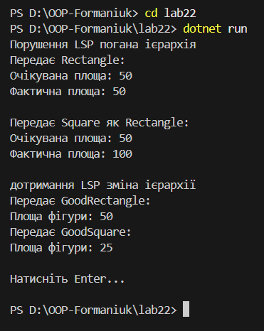

# **Лабораторна робота №22**

## **Принцип підстановки Лісков (LSP): виявлення порушень і альтернативи**

### **Мета роботи**

Поглибити розуміння принципу підстановки Лісков (LSP), навчитися виявляти його порушення в ієрархіях класів та застосовувати альтернативні підходи (зміна ієрархії) для створення LSP-сумісних рішень.

## **Обраний варіант**

**Варіант 1 — Геометричні фігури (Rectangle & Square)**
Даний варіант є наочним і простим, оскільки дозволяє легко продемонструвати порушення LSP та його вплив на клієнтський код.

## **1. Початкова ієрархія класів (з порушенням LSP)**

У початковій реалізації використовується базовий клас `Rectangle` з властивостями `Width` та `Height`.  
Похідний клас `Square` наслідується від `Rectangle` і змінює поведінку цих властивостей так, що при зміні однієї сторони автоматично змінюється інша.

### **Очікування базового класу (контракт)**

Клас `Rectangle` передбачає, що:

- ширина і висота можуть змінюватися незалежно;
- площа обчислюється як `Width * Height`.

### **Суть проблеми**

Клієнтський код працює з типом `Rectangle` і очікує, що зміна ширини не вплине на висоту.  
Проте при підстановці об’єкта `Square` ця умова порушується, оскільки `Square` примусово синхронізує ширину і висоту.

У результаті клієнтський код отримує некоректний результат, що означає порушення принципу підстановки Лісков.

## **2. Аналіз порушення принципу LSP**

Принцип підстановки Лісков говорить, що об’єкти похідного класу повинні повністю замінювати об’єкти базового класу без порушення коректності роботи програми.

У даному випадку:

- `Square` змінює поведінку методів і властивостей базового класу `Rectangle`;
- клієнтський код, який коректно працює з `Rectangle`, починає працювати неправильно з `Square`.

Отже, клас `Square` не є коректною підстановкою для `Rectangle`, що є прямим порушенням LSP.

## **3. Альтернативне рішення (дотримання LSP)**

Для усунення проблеми було застосовано **зміну ієрархії класів**

### **Суть рішення**

- Введено спільний інтерфейс `IShape` з методом `Area()`.
- Класи `Rectangle` і `Square` більше не наслідуються один від одного.
- Кожна фігура реалізує власну логіку обчислення площі.

Таким чином, кожен клас відповідає своєму контракту і не порушує очікування клієнтського коду.

## **4. Демонстрація роботи в Main**

У методі `Main`:

- показано некоректну роботу клієнтського коду для початкової ієрархії;
- продемонстровано правильну роботу клієнтського коду після рефакторингу з використанням нової структури класів.

Після вводу команди

`dotnet run`
виводиться результат

## **5. Висновки**

У ході виконання лабораторної роботи було виявлено, що неправильне використання наслідування може призводити до порушення принципу підстановки Лісков.
Зміна ієрархії класів та використання спільного інтерфейсу дозволяє уникнути цієї проблеми.
