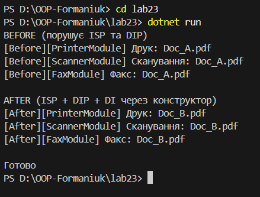

# **Лабораторна робота №23**

## **Тема**

`ISP & DIP`: рефакторинг і `Dependency Injection (DI)` через конструктор.

## **Мета роботи**

Застосувати принцип розділення інтерфейсів `(ISP)` та принцип інверсії залежностей `(DIP)` для рефакторингу існуючого коду, а також реалізувати `Dependency Injection (DI)` через конструктор з метою зменшення зв’язаності та покращення тестованості коду.

## **Обраний варіант завдання**

**Варіант №4 — Document Multifunction Machine (SmartMachine)**
SmartMachine може:

- друкувати документи;
- сканувати документи;
- надсилати документи факсом.

## **Початкова реалізація (Before)**

У папці `Before` реалізовано початкову структуру, яка **навмисно порушує принципи ISP та DIP**.

### **Порушення принципу ISP**

Використовується інтерфейс `IMultifunctionDevice`, який містить методи:

- `Print()`
- `Scan()`
- `Fax()`

Клієнт, якому потрібен лише друк, змушений залежати від методів сканування та факсу, які він не використовує.  
Це є класичним порушенням принципу розділення інтерфейсів `(ISP)`.

### **Порушення принципу DIP**

Клас `SmartMachine` у папці `Before` створює залежності безпосередньо всередині себе:

- `new PrinterModule()`
- `new ScannerModule()`
- `new FaxModule()`

Таким чином, модуль вищого рівня напряму залежить від конкретних реалізацій модулів нижчого рівня, що порушує принцип інверсії залежностей `(DIP)`.

## **Рефакторинг (After)**

У папці `After` виконано рефакторинг з дотриманням принципів ISP та DIP.

### **Реалізація ISP**

Замість одного загального інтерфейсу було створено вузькоспеціалізовані інтерфейси:

- `IPrinter` — відповідає лише за друк;
- `IScanner` — відповідає лише за сканування;
- `IFax` — відповідає лише за надсилання факсу.

Кожен клас реалізує тільки ті методи, які йому дійсно потрібні.

### **Реалізація `DIP` та `Dependency Injection`**

Клас `SmartMachine` більше не створює залежності самостійно.  
Замість цього він залежить від абстракцій (інтерфейсів), а конкретні реалізації передаються через конструктор (`Dependency Injection`).

Це дозволяє:

- зменшити зв’язаність коду;
- легко замінювати реалізації;
- покращити тестованість системи.

## **Демонстрація роботи**

У файлі `Program.cs`:

1. Створюються конкретні реалізації модулів (`PrinterModule`, `ScannerModule`, `FaxModule`);
2. Вони передаються у `SmartMachine` через конструктор;
3. Викликаються основні методи (`Print`, `Scan`, `Fax`) для перевірки працездатності.

Після вводу команди

`dotnet run`
виводиться результат

## **Висновки**

У ході виконання лабораторної роботи було проаналізовано початковий код, який порушував принципи ISP та DIP.  
Після рефакторингу код став більш структурованим, гнучким і зрозумілим.  
Використання Dependency Injection через конструктор дозволило усунути жорсткі залежності між класами та покращити якість архітектури програми.
