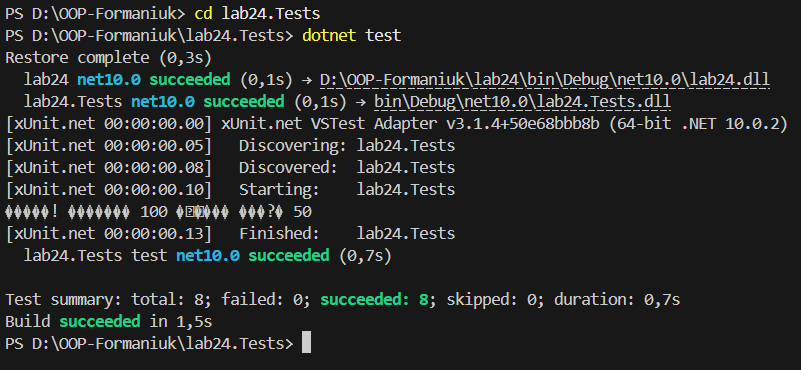

# **Лабораторна робота №24**

## **Патерни Strategy та Observer**

---

## **Тема**

Застосування шаблонів проєктування **Strategy** та **Observer** для створення гнучкої системи обробки числових даних з підтримкою unit-тестування.

## **Мета роботи**

Метою лабораторної роботи є закріплення практичних навичок використання патернів **Strategy** та **Observer** у мові програмування C#, а також перевірка коректності їх реалізації за допомогою unit-тестів.

## **Реалізаціїя**

У роботі реалізовано систему обробки числових даних, яка дозволяє:

- динамічно змінювати алгоритми обчислення під час виконання програми;
- автоматично сповіщати зацікавлені компоненти про результати обчислень;
- відокремити логіку обробки від логіки реагування на результати.

### **Патерн Strategy**

Патерн **Strategy** використано для інкапсуляції різних алгоритмів обчислення чисел.  
Реалізовано декілька стратегій (квадрат, куб, квадратний корінь), які можна змінювати під час виконання програми без зміни коду процесора.

### **Патерн Observer**

Патерн **Observer** реалізовано через події C#.  
Після кожного обчислення результат публікується, а всі підписані спостерігачі автоматично отримують повідомлення та виконують відповідні дії (вивід у консоль, збереження історії, перевірка порогового значення).

## **Unit-тестування**

Для перевірки коректності реалізації використано **xUnit**.

Unit-тести перевіряють:

- правильність роботи кожної стратегії;
- можливість динамічної зміни стратегії;
- коректну роботу механізму сповіщення (Observer);
- відсутність помилок під час виконання програми.

Запуск тестів:

`dotnet test`

Запуск програми:

`dotnet run`

## **Висновок**

У ході лабораторної роботи було успішно реалізовано шаблони проєктування `Strategy та Observer`, що дозволило створити гнучку, розширювану та тестовану систему обробки числових даних.
Робота демонструє практичне застосування принципів об’єктно-орієнтованого програмування та `unit`-тестування в `C#`.
