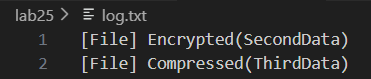
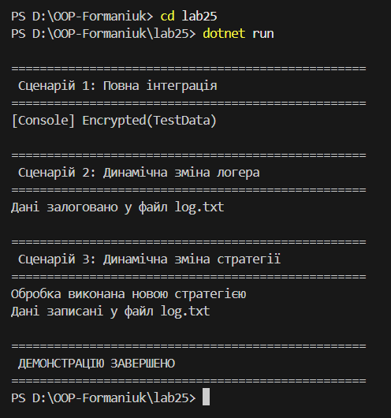
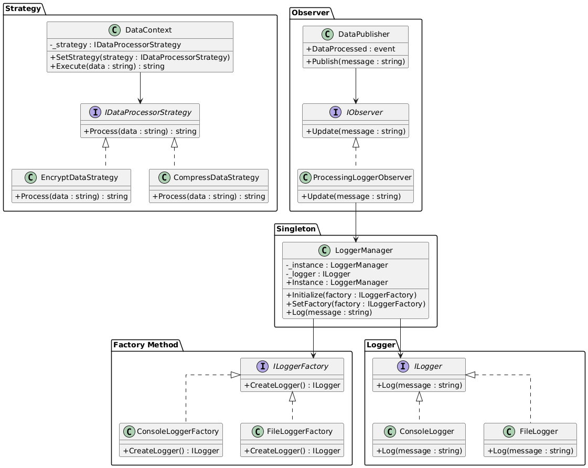

# **Лабораторна робота №25**

## **Тема: Інтеграція патернів проєктування**

## **Мета роботи**

Розробити консольний застосунок, який демонструє взаємодію між компонентами, що реалізують патерни:

- **`Factory Method`**
- **`Singleton`**
- **`Strategy`**
- **`Observer`**

Перевірити коректність їх спільної роботи та можливість динамічної зміни поведінки системи.

## **Архітектура системи**

Система складається з наступних логічних блоків:

- `DataContext (Strategy)`

- `DataPublisher (Observer)`

- `ProcessingLoggerObserver`

- `LoggerManager (Singleton)`

- `LoggerFactory (Factory Method)`

- `Concrete Logger`

## **Реалізація патернів**

### **`Strategy`**

**Призначення:** дозволяє змінювати алгоритм обробки даних під час виконання програми.

**Реалізовано:**

- `IDataProcessorStrategy`
- `EncryptDataStrategy`
- `CompressDataStrategy`
- `DataContext`

Метод `SetStrategy()` дозволяє динамічно змінити алгоритм обробки.

### **`Factory Method`**

**Призначення:** створення об’єктів логера без жорсткої прив’язки до конкретної реалізації.

**Реалізовано:**

- `ILoggerFactory`
- `ConsoleLoggerFactory`
- `FileLoggerFactory`

Фабрика визначає, який саме логер буде створений.

### **`Singleton`**

**Призначення:** забезпечує існування лише одного екземпляра логера.

**Реалізовано:**

- `LoggerManager`

Має:

- статичну властивість `Instance`
- метод `Initialize()`
- можливість змінювати фабрику логування

### **`Observer`**

**Призначення:** автоматичне сповіщення підписників після обробки даних.

**Реалізовано:**

- `DataPublisher`
- `ProcessingLoggerObserver`

Після обробки даних викликається подія `DataProcessed`.

## **Демонстраційні сценарії**

### **Сценарій 1: Повна інтеграція**

1. Ініціалізація `LoggerManager` з `ConsoleLoggerFactory`
2. Створення `DataContext` з `EncryptDataStrategy`
3. Підписка `ProcessingLoggerObserver`
4. Обробка та публікація даних

**Результат:**  
Дані зашифровані та залоговані у консоль.

### **Сценарій 2: Динамічна зміна логера**

1. Зміна фабрики на `FileLoggerFactory`
2. Повторна обробка даних

**Результат:**  
Логування записується у файл `log.txt`.

### **Сценарій 3: Динамічна зміна стратегії**

1. Зміна стратегії на `CompressDataStrategy`
2. Повторна обробка даних

**Результат:**  
Обробка відбувається за новим алгоритмом.

## **Запуск програми**

`dotnet run`

