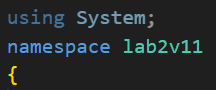
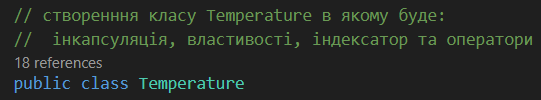
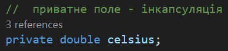
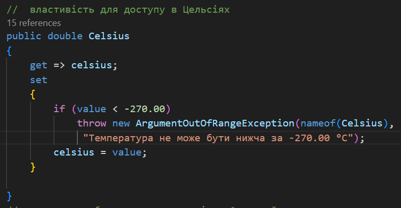
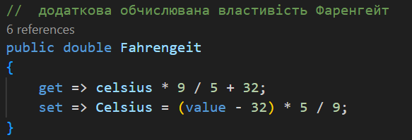
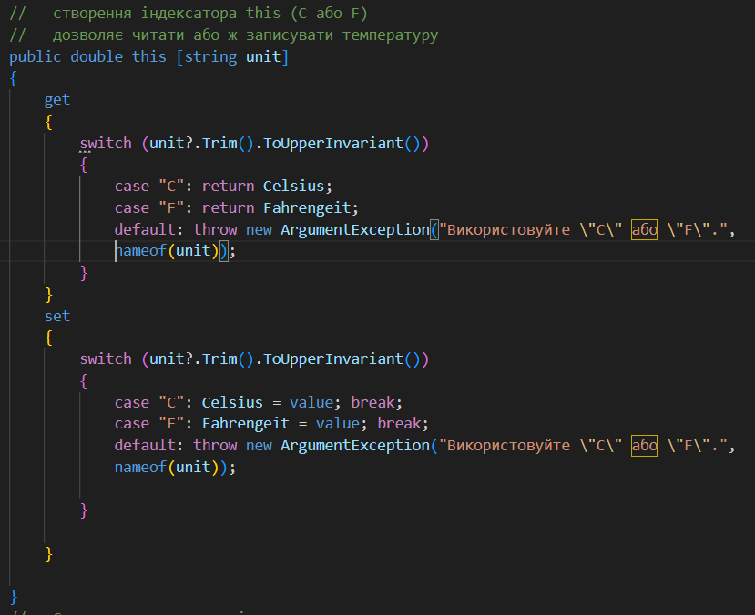
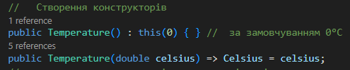
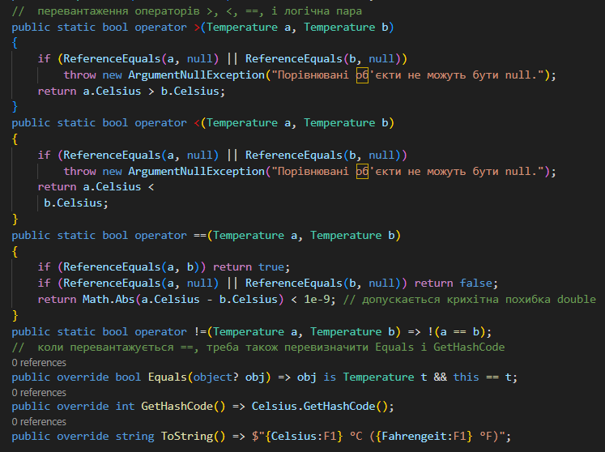
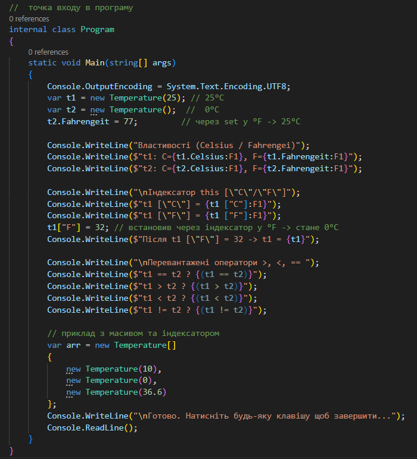
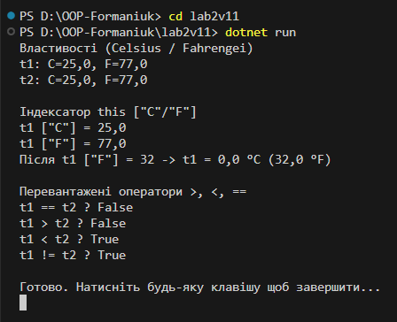

# Хід виконання лабораторної lab2v11
## Простір імен
Підключаю простір імен using System для доступу класів .NET, особливо до класу Console 

## Простір імен
Далі оголошую простір імен namespace lab2v11 у якому описую класи. Створюю class Temperature 

  
## Інкапсуляція
Додаю Інкапсуляцію приватне поле celsius, як зберігає значення температури в градусах Цельсія. Поле приховане від завнішнього доступу (принцип інкапсуляції)

## Публічна властивість
Створюю публічну воастивість Celsius для роботи з температурою в градусах Цельсія. Вона дозволяє як читати (get), так і змінювати (set) значення. Додана перевірка (температура не може бути нижчою за -270 °C)

## Обчислювальна властивість
Додатково створюю обчислювану властивість Fahrenheit, яка переводить температуру у Фаренгейти та дозволяє задавати її у цій шкалі.  

## Індексатор
Реалізую індексатор this[string unit], який дозволяє звертатись до значення температури як у °C так у °F
t["C"] повертає температуру в Цельсіях
t["F"] повертає температуру у Фаренгейтах
можна також задавати значення через цей індексатор.

## Конструктор
Створюю два конструктори у класі Temperature, без параметра(який викликає інший з параметром) та з парамотром (який дозволяє створити об'єкт і передати значення температури в градусах Цельсія)

## Оператор
Реалізую оператори перевантаження (порівняння) >, <, ==, (i !=). Це дозволяє безпосередньо порівнювати об'єкти типу Temperature.

## Клас
Далі йде клас з Program та метод Main в якому демонструється робота створеного класу Temperature.

## Результат
Після запуску (dotnet run) виводиться результат у консолі створених значень температури, робота властивостей, індексатора та оператора.

.

