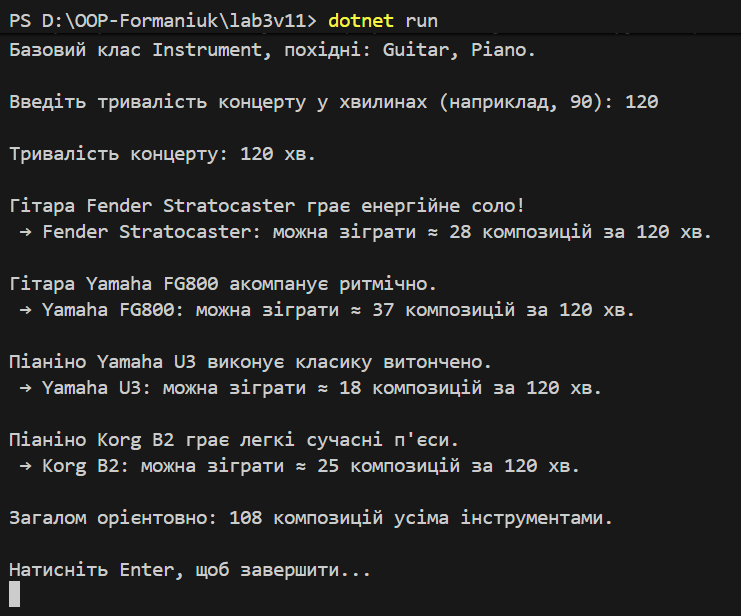

# Лабораторна робота №3 - Наслідування. (варіант №11)

* Тема  Наслідування: основи
* Мета  Закріпити знання про базові - похідні класи, модифікатори доступу, "base", поліморфізм.

## Варіант 11: Музичні інструменти.
  * **Базовий клас**: `Instrument` (`Play()`, `CountPiecesForConcert()`).
  * **Похідні**: `Guitar`, `Piano`.
  * **Обчислення**: за заданою тривалістю концерту (хв) визначити кількість композицій, які може зіграти кожен інструмент.

## Реалізація.
  * **`Instrument`**: інкапсульовані поля - властивості, `virtual` методи.
  * **`Guitar`, `Piano`**: конструктори з викликом `base(...)`, `override` методів; власні параметри (соло/класика), що впливають на розрахунок.
  * **Поліморфізм**: колекція "List<Instrument>", виклики "Play()" і "CountPiecesForConcert()".

## Приклад запуску.
* Після зупуску (dotnet run) виводиться повідомлення для користувача, щоб ввести значення. Програма підтверджує тривалість і для кожного інструмента виводить орієнтовну кількість композицій. 

