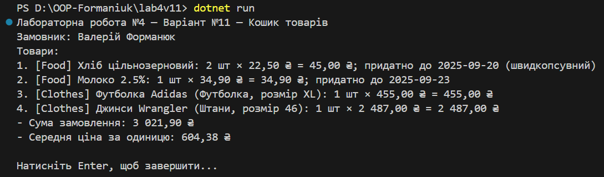

## Лабораторна робота №4 - Абстракції та інтерфейси (варіант №11)

**Тума: Абстракції та інтерфейси. Композиція та агрегація.**
* Мета: Навчитися створювати абстрактні класи та інтерфейси, будувати ієрархії класів із використанням композиції та агрегації, реалізовувати прості обчислення, демонструвати гнучкість і повторне використання коду.

## Варіант 11: Кошик товарів.
* **Інтерфейс** `IProduct`, який задає контракт для будь-якого товару (властивості `Name`, `UnitPrice`, `Quantity`, методи `TotalPrice()`, `Describe()`).
* **Реалізовано** абстрактний клас `ProductBase` із базовою логікою для всіх товарів.
* **Розроблено** два класи - нащадки:
 `Food` (їжа, з терміном придатності),
 `Clothes` (одяг зкатегорією та розміром).
* **Клас** `Cart`, реалізує композицію (кошик який містить список товарів).
* **Класи** `Customer` i `Order` реалізують агрегацію (замовлення використовує готовий кошик і замовника).
* **Програма** обчислює суму замовлення та середню ціну за одиницю, а також виводить список товарів.
## Приклад запуску.
* Після запуску (dotnet run) На екран виводиться:
* 

