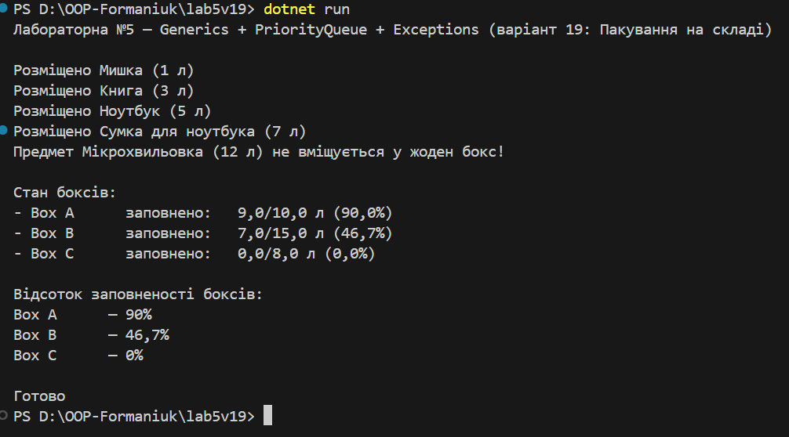

# Лабораторна робота №5 (Варіант 19 — бонус)
**Тема:** Узагальнені типи, колекції і LINQ, обробка винятків  
**Завдання:** “Пакування на складі” (PackPlanner/BoxItem)

## Суть
- Композиція: `PackPlan` містить бокси (`BoxItem`).
- Обчислення: заповненість (%) кожного боксу, залишковий простір.
- Використано Generics: `PriorityQueue<T>` на основі `SortedSet<T>`.
- Власний виняток: `ItemTooLargeException` — коли предмет не влазить у жоден бокс.

## Запуск 
Після вводу команди

`dotnet run`
виводиться результат

