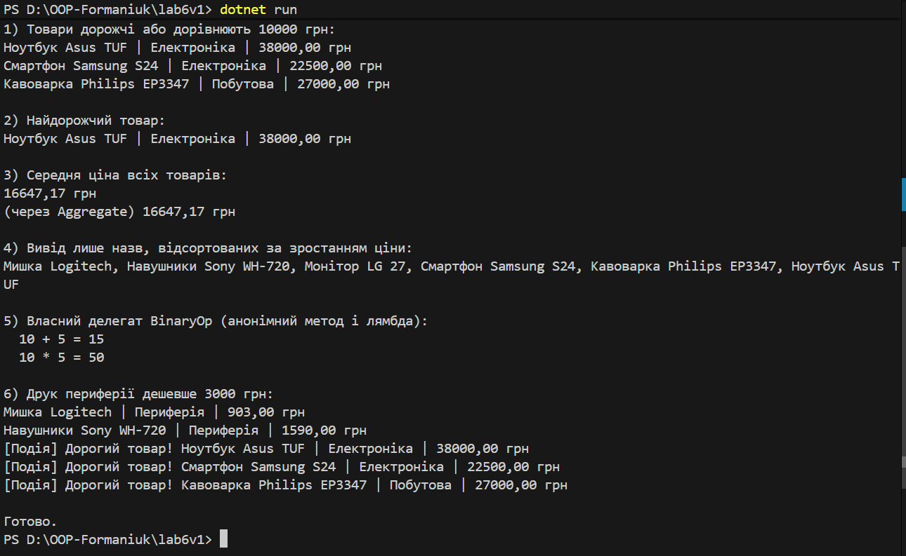

# Лабораторна робота №6 — Лябда-вирази, анонімні функції та делегати у C# (варіант 1)
**Завдання варіанту 1:**  реалізувати клас Product (Name, Price, Category) і за допомогою лямбда-виразів зробити фільтрацію за ціною, пошук найдорожчого та обчислення середньої вартості. Також показати приклади анонімних методів, вбудованих делегатів (Func<>, Action<>, Predicate<>), власного делегата, LINQ-операції (Where, Select, OrderBy, Aggregate, Average) і (бонус) подію.

## Що зроблено

`Product`: проста модель (`Name, Price, Category`)

**Вбудовані делегати:**
`Predicate<Product> isExpensive = p => p.Price >= 10000m;`
`Func<Product, decimal> getPrice = p => p.Price;`
`Action<Product> print = p => Console.WriteLine(p);`

**Анонімний метод:**
`BinaryOp addAnon = delegate(decimal x, decimal y) { return x + y; };`

**Лямбда-вираз для власного делегата:**
`BinaryOp mulLambda = (x, y) => x * y;`

**Власний делегат:** `public delegate decimal BinaryOp(decimal x, decimal y);` + метод `Apply(BinaryOp op)`

`LINQ:`

**Фільтр:** `products.Where(p => isExpensive(p))`

**Найдорожчий:** `products.OrderByDescending(getPrice).First()`

**Середня ціна:** `products.Average(getPrice)`

**Додатково:** `Aggregate` для суми, `Select` для назв, `OrderBy` за ціною

**Бонусна подія:** `event Action<Product>? OnOverpriced;` з викликом `OnOverpriced?.Invoke(p).`

**Запуск** 
Після вводу команди 

`dotnet run`

виводиться результат

