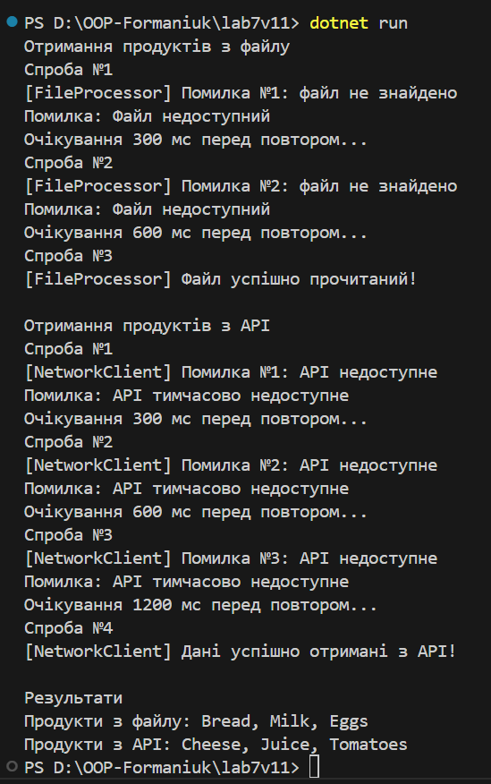

# Лабораторна робота №7 - Обробка помилок та патерн `Retry` (варіант №11)

**Тема:** Обробка IO/мережевих помилок та реалізація патерну `Retry`.
**Мета:** Навчитися обробляти винятки вводу/виводу та мережеві помилки за допомогою `try-catch-finally`. а також реалізувати патерн `Retry` з експоненційною затримкою.

## Варіант 11: Отримання списку продуктів

## `FileProcessor`
Клас, що імітує роботу з файлами.
Метод `LoadProductNames(path)` перші 2 рази кидає `FileNotFoundException`, а потім повертає успішний результат.

## `NetworkClient`
Клас, що імітує мережевий запит до `API`.
Метод `GetProductsFromApi(url)` перші 3 рази кидає `HttpRequestException`, а потім повертає список продуктів.

## `RetryHelper`
Універсальний допоміжний клас для повторних спроб.

### Реалізовано:
* до 3-5 повторних спроб;
* експоненційна затримка між повтореннями;
* логування кожної спроби;
* делегат `shouldRetry`, що вирішує, повторювати помилку чи ні;
* певернення результату або кидання помилки після всіх спроб.

### У `Main()` демонструється 2 сценарії:
1) Читання файлу
2) Отримання даних з `API`

## Запуск
Після вводу команди

`dotnet run`

виводиться результат
